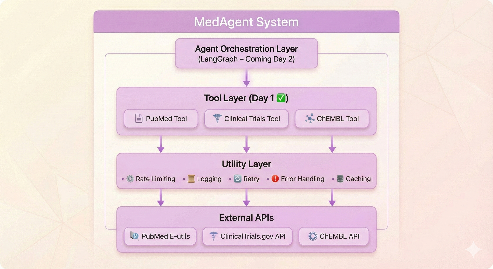

# MedAgent - Autonomous Drug Discovery Research Assistant

**Day 1: API Tool Wrappers** ✅

MedAgent is an autonomous AI-powered drug discovery research assistant that leverages agentic AI to help researchers explore scientific literature, clinical trials, and chemical databases. This is a real agentic AI system, not just a wrapper around an LLM.

## 🎯 What is MedAgent?

MedAgent solves the problem of information overload in biomedical research by providing:

- **Automated Literature Review**: Search and analyze millions of scientific papers from PubMed
- **Clinical Trial Intelligence**: Discover relevant clinical trials across diseases and interventions
- **Drug Discovery Insights**: Access comprehensive chemical and drug information from ChEMBL
- **Autonomous Research**: AI agents that can independently gather, synthesize, and analyze biomedical data

## 🏗️ Architecture




## 📋 Features (Day 1)

### ✅ PubMed Tool
- Search scientific literature with date filtering
- Extract paper details (title, abstract, authors, DOI)
- Rate-limited to 3 requests/second
- XML response parsing

### ✅ ClinicalTrials Tool
- Search trials by condition, intervention, phase, status
- Pagination support for large result sets
- Filter by trial status (RECRUITING, COMPLETED, etc.)
- Extract comprehensive trial details

### ✅ ChEMBL Tool
- Search compounds by protein target
- Get detailed drug information
- Search drugs by disease indication
- Development phase tracking

### ✅ Core Infrastructure
- **Rate Limiting**: Token bucket algorithm for API compliance
- **Retry Logic**: Exponential backoff for transient failures
- **Caching**: In-memory caching with TTL
- **Logging**: Structured JSON logging with console output
- **Error Handling**: Graceful degradation and user-friendly messages

## 🚀 Installation

### Prerequisites
- Python 3.10 or higher
- pip package manager
- Virtual environment (recommended)

### Quick Setup

```bash
# Clone or navigate to the project
cd ~/Documents/MedAgent

# Run automated setup script
chmod +x setup.sh
./setup.sh
```

### Manual Setup

```bash
# Create virtual environment
python3 -m venv venv

# Activate virtual environment
source venv/bin/activate  # On macOS/Linux
# OR
venv\Scripts\activate  # On Windows

# Install dependencies
pip install --upgrade pip
pip install -r requirements.txt
```

### Environment Configuration

```bash
# Copy example environment file
cp .env.example .env

# Edit .env and add your API keys (optional for Day 1)
# NVIDIA NIM API key will be needed for Day 2
```

## 📚 Quick Start

### Example 1: Search PubMed

```python
from tools.pubmed_tool import PubMedTool

# Initialize tool
pubmed = PubMedTool()

# Search for papers
result = pubmed.search_pubmed(
    "EGFR inhibitors lung cancer",
    max_results=5
)

if result.success:
    for paper in result.data:
        print(f"{paper['title']}")
        print(f"PMID: {paper['pmid']}")
        print(f"Year: {paper['year']}\n")
```

### Example 2: Search Clinical Trials

```python
from tools.clinical_trials_tool import ClinicalTrialsTool

# Initialize tool
ct = ClinicalTrialsTool()

# Search for trials
result = ct.search_trials(
    condition="lung cancer",
    intervention="pembrolizumab",
    status="RECRUITING"
)

if result.success:
    for trial in result.data:
        print(f"{trial['title']}")
        print(f"NCT ID: {trial['nct_id']}")
        print(f"Phase: {trial['phase']}\n")
```

### Example 3: Search ChEMBL

```python
from tools.chembl_tool import ChEMBLTool

# Initialize tool
chembl = ChEMBLTool()

# Search by target
result = chembl.search_by_target("EGFR", max_results=5)

if result.success:
    for compound in result.data:
        print(f"{compound['name']}")
        print(f"Phase: {compound['development_phase']}")
        print(f"Mechanism: {compound['mechanism_of_action']}\n")
```

## 🧪 Running Examples

```bash
# Activate virtual environment
source venv/bin/activate

# Run PubMed examples
python examples/test_pubmed.py

# Run ClinicalTrials examples
python examples/test_clinical_trials.py

# Run ChEMBL examples
python examples/test_chembl.py
```

## 🧰 Tool Documentation

### PubMed Tool

**Methods:**
- `search_pubmed(query, max_results=10, years_back=2)` - Search for papers
- `get_paper_details(pmid)` - Get details for specific paper

**Limitations:**
- Rate limit: 3 requests/second
- No authentication required
- Date filtering: defaults to last 2 years

### ClinicalTrials Tool

**Methods:**
- `search_trials(condition, intervention, status, phase, max_results)` - Search trials
- `get_trial_details(nct_id)` - Get specific trial details

**Limitations:**
- Rate limit: 10 requests/second
- Pagination: 100 results per page
- No authentication required

### ChEMBL Tool

**Methods:**
- `search_by_target(target_name, max_results=10)` - Search compounds by target
- `get_drug_info(chembl_id)` - Get drug information
- `search_by_indication(disease, max_results=20)` - Search by indication

**Limitations:**
- Rate limit: 10 requests/second
- No authentication required
- REST API with JSON responses

## 🧪 Testing

```bash
# Run all tests
pytest tests/ -v

# Run specific tool tests
pytest tests/test_pubmed.py -v
pytest tests/test_clinical_trials.py -v
pytest tests/test_chembl.py -v

# Run with coverage
pytest tests/ --cov=tools --cov-report=html
```

## 📁 Project Structure

```
MedAgent/
├── README.md                    # This file
├── requirements.txt             # Dependencies
├── setup.py                     # Package installer
├── .env.example                 # Environment template
├── .gitignore                   # Git ignore rules
│
├── config/                      # Configuration
│   ├── __init__.py
│   └── settings.py              # Centralized settings
│
├── tools/                       # Tool implementations
│   ├── __init__.py
│   ├── base_tool.py             # Abstract base class
│   ├── pubmed_tool.py           # PubMed wrapper
│   ├── clinical_trials_tool.py  # ClinicalTrials wrapper
│   └── chembl_tool.py           # ChEMBL wrapper
│
├── utils/                       # Utilities
│   ├── __init__.py
│   ├── logger.py                # Structured logging
│   ├── rate_limiter.py          # Rate limiting
│   └── retry_handler.py         # Retry logic
│
├── tests/                       # Unit tests
│   ├── __init__.py
│   ├── test_pubmed.py
│   ├── test_clinical_trials.py
│   └── test_chembl.py
│
├── examples/                    # Usage examples
│   ├── test_pubmed.py
│   ├── test_clinical_trials.py
│   └── test_chembl.py
│
├── docs/                        # Documentation
│   ├── architecture.md
│   ├── api_documentation.md
│   └── tool_specifications.md
│
└── logs/                        # Log files
    └── medagent.log
```

## 🔧 Development Guide

### Adding a New Tool

1. Create a new file in `tools/` directory
2. Inherit from `BaseTool` class
3. Implement required methods:
   - `execute()` - Main tool logic
   - `parse_results()` - Parse API responses
4. Add rate limiting decorators
5. Write tests in `tests/`
6. Add examples in `examples/`

**Example:**

```python
from tools.base_tool import BaseTool, ToolResult
from utils.rate_limiter import rate_limit

class MyNewTool(BaseTool):
    def __init__(self):
        super().__init__(
            name="MyTool",
            base_url="https://api.example.com/",
            rate_limit=10
        )

    def parse_results(self, raw_data):
        # Parse API response
        return parsed_data

    def execute(self, query, **kwargs):
        # Main tool logic
        return self._execute_with_monitoring(
            "my_method",
            query,
            lambda: self._api_call(query)
        )
```

### Code Style

- Follow PEP 8 style guide
- Use type hints for all functions
- Write docstrings (Google style)
- Maximum line length: 100 characters
- Use meaningful variable names

### Running Code Quality Checks

```bash
# Format code
black .

# Lint code
flake8 .

# Type checking
mypy tools/ utils/
```

## 🗺️ Roadmap

### ✅ Day 1: Tool Wrappers (COMPLETED)
- [x] PubMed E-utilities wrapper
- [x] ClinicalTrials.gov API wrapper
- [x] ChEMBL API wrapper
- [x] Rate limiting and retry logic
- [x] Caching and logging
- [x] Comprehensive tests
- [x] Usage examples

### 📅 Day 2: Agent Orchestration
- [ ] Integrate NVIDIA NIM (Nemotron)
- [ ] Build LangGraph agent workflow
- [ ] Multi-step research capabilities
- [ ] Query planning and decomposition
- [ ] Result synthesis and summarization

### 📅 Day 3: Frontend & Evaluation
- [ ] Web interface (Streamlit/Gradio)
- [ ] Conversation history
- [ ] Export functionality
- [ ] Evaluation metrics
- [ ] Benchmark dataset

## 🐛 Troubleshooting

### Common Issues

**Import Errors:**
```bash
# Make sure you're in the virtual environment
source venv/bin/activate

# Reinstall dependencies
pip install -r requirements.txt
```

**API Rate Limiting:**
- Rate limiting is automatic
- Check logs for rate limit messages
- Adjust settings in `config/settings.py`

**Connection Errors:**
- Check internet connection
- Verify API endpoints are accessible
- Check firewall settings

## 📄 License

MIT License - See LICENSE file for details

## 🤝 Contributing

Contributions are welcome! Please:

1. Fork the repository
2. Create a feature branch
3. Write tests for new functionality
4. Ensure all tests pass
5. Submit a pull request

## 📧 Contact

For questions or issues:
- GitHub Issues: [Create an issue](https://github.com/yourusername/medagent/issues)
- Email: medagent@example.com

## 🙏 Acknowledgments

- **PubMed/NCBI** - For providing free access to biomedical literature
- **ClinicalTrials.gov** - For clinical trial data
- **ChEMBL/EBI** - For chemical and drug information
- **NVIDIA** - For NIM API / Nemotron models (Day 2+)
- **LangChain/LangGraph** - For agent orchestration framework

---

**Built with ❤️ for biomedical research**

*Last Updated: Day 1 - November 2024*
